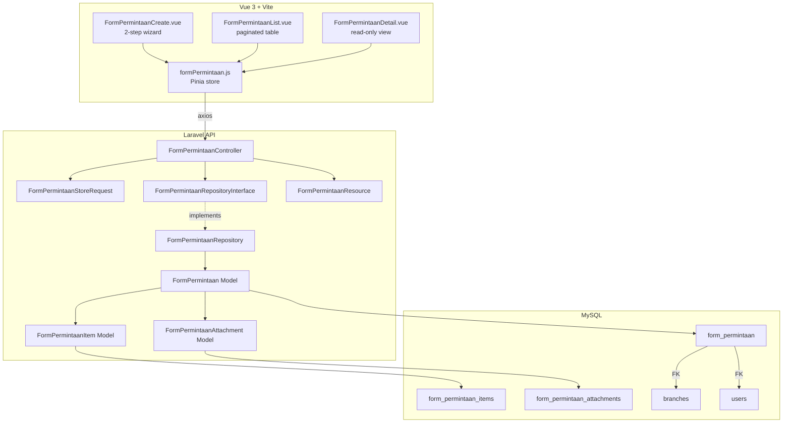
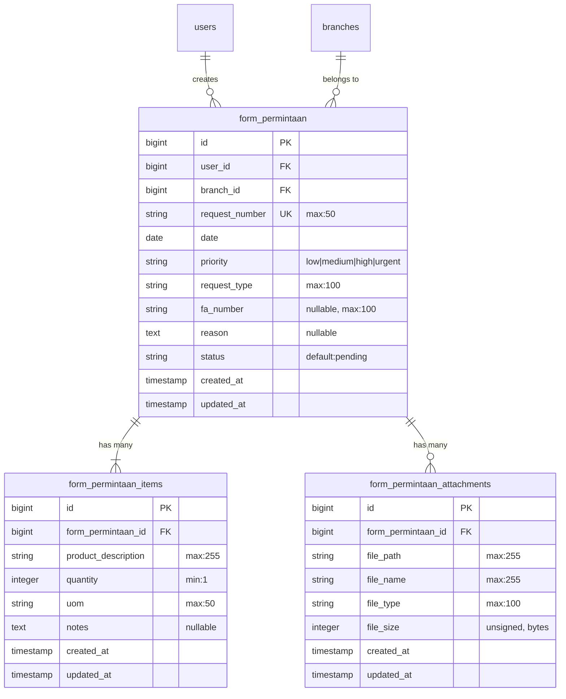

# Design Document: Form Permintaan

## Overview

Form Permintaan is a digital request form feature that enables staff users to submit purchase, replacement, service, part replacement, or jasa (service) requests for their outlet. The system follows the existing helpdesk application patterns: Vue 3 multi-step wizard frontend, Laravel RESTful API backend with Repository pattern, Spatie permissions, and FormRequest validation.

The feature introduces three new database tables (`form_permintaan`, `form_permintaan_items`, `form_permintaan_attachments`), a new Pinia store, three Vue views (list, create, detail), and corresponding backend API endpoints. Request numbers are auto-generated using a format based on submission date, outlet code, and a monthly sequence counter.

## Architecture



### Key Design Decisions

1. **Multi-step wizard pattern**: Mirrors the existing `TicketCreate.vue` — Step 1 for form data, Step 2 for attachments. The form is submitted at Step 1, then attachments are uploaded to the created record at Step 2.

2. **Request number generation**: Uses database-level locking (`lockForUpdate`) within a transaction to atomically generate sequence numbers, consistent with how `TicketRepository.generateTicketCode()` works.

3. **Repository pattern**: Follows the established `TicketRepositoryInterface` / `TicketRepository` pattern with interface binding in the service provider.

4. **File uploads**: Attachments are stored on disk (`storage/app/public/form-permintaan/`) and references saved to `form_permintaan_attachments`. Upload happens per-file after the main form record is created (same pattern as ticket attachments).

5. **Permission model**: Uses Spatie Permission with `form-permintaan-create` and `form-permintaan-list` permissions, consistent with existing `ticket-create`, `ticket-list` naming.

## Components and Interfaces

### Backend Components

#### FormPermintaanController
```php
class FormPermintaanController extends Controller implements HasMiddleware
{
    public static function middleware(): array;
    public function store(FormPermintaanStoreRequest $request): JsonResponse;
    public function index(Request $request): JsonResponse;       // paginated list
    public function show(string $id): JsonResponse;              // detail
}
```

#### FormPermintaanRepositoryInterface
```php
interface FormPermintaanRepositoryInterface
{
    public function create(array $data): FormPermintaan;
    public function getAllPaginated(?string $search, int $rowPerPage): LengthAwarePaginator;
    public function getById(string $id): FormPermintaan;
    public function addAttachment(string $formPermintaanId, array $fileData): FormPermintaanAttachment;
}
```

#### FormPermintaanStoreRequest
```php
class FormPermintaanStoreRequest extends FormRequest
{
    public function rules(): array
    {
        return [
            'branch_id'                   => ['required', 'exists:branches,id'],
            'priority'                    => ['required', 'in:low,medium,high,urgent'],
            'request_type'                => ['required', 'in:pembelian_produk_baru,penggantian_produk_lama,servis,penggantian_part,jasa'],
            'fa_number'                   => ['required_if:request_type,penggantian_produk_lama,servis,penggantian_part', 'nullable', 'string', 'max:100'],
            'reason'                      => ['required_if:request_type,pembelian_produk_baru', 'nullable', 'string'],
            'items'                       => ['required', 'array', 'min:1', 'max:20'],
            'items.*.product_description' => ['required', 'string', 'max:255'],
            'items.*.quantity'            => ['required', 'integer', 'min:1', 'max:9999'],
            'items.*.uom'                 => ['nullable', 'string', 'max:50'],
            'items.*.notes'               => ['nullable', 'string'],
        ];
    }
}
```

#### FormPermintaanResource
```php
class FormPermintaanResource extends JsonResource
{
    public function toArray(Request $request): array
    {
        return [
            'id'             => $this->id,
            'request_number' => $this->request_number,
            'date'           => $this->date,
            'priority'       => $this->priority,
            'request_type'   => $this->request_type,
            'fa_number'      => $this->fa_number,
            'reason'         => $this->reason,
            'status'         => $this->status,
            'created_at'     => $this->created_at,
            'user'           => new UserResource($this->whenLoaded('user')),
            'branch'         => new BranchResource($this->whenLoaded('branch')),
            'items'          => FormPermintaanItemResource::collection($this->whenLoaded('items')),
            'attachments'    => FormPermintaanAttachmentResource::collection($this->whenLoaded('attachments')),
        ];
    }
}
```

### Frontend Components

#### Pinia Store: `formPermintaan.js`
```javascript
// State
{ forms: [], meta: {...}, form: null, loading: false, error: null, success: null }

// Actions
async createFormPermintaan(payload): Promise<FormPermintaan>
async fetchFormPermintaanPaginated(params): void
async fetchFormPermintaan(id): Promise<FormPermintaan>
async uploadAttachment(formId, file): Promise<Attachment>
```

#### Vue Views
| View | Route | Description |
|------|-------|-------------|
| `FormPermintaanList.vue` | `/form-permintaan` | Paginated table with request forms |
| `FormPermintaanCreate.vue` | `/form-permintaan/create` | 2-step wizard (form + attachments) |
| `FormPermintaanDetail.vue` | `/form-permintaan/:id` | Read-only detail with items & attachments |

### API Endpoints

| Method | Path | Permission | Description |
|--------|------|------------|-------------|
| POST | `/form-permintaan` | `form-permintaan-create` | Create request form with items |
| GET | `/form-permintaan` | `form-permintaan-list` | Paginated list (user-scoped) |
| GET | `/form-permintaan/{id}` | `form-permintaan-list` | Detail with items & attachments |
| POST | `/form-permintaan/{id}/attachments` | `form-permintaan-create` | Upload attachment file |

## Data Models

### Entity Relationship Diagram



### Request Number Format

Format: `{DD}/{OUTLET_CODE}/FP{YY}/{M}/{YYYY}`

| Segment | Description | Example |
|---------|-------------|---------|
| DD | Two-digit day (from server date) | `15` |
| OUTLET_CODE | Branch code from branches table | `HGAM` |
| FP{YY} | "FP" prefix + zero-padded sequence (01-99) | `FP01` |
| M | Numeric month (1-12, no padding) | `6` |
| YYYY | Four-digit year | `2025` |

Example: `15/HGAM/FP01/6/2025`

Sequence resets to 01 at the start of each month per outlet. Maximum 99 requests per outlet per month.

### Eloquent Models

#### FormPermintaan
```php
class FormPermintaan extends Model
{
    protected $table = 'form_permintaan';
    protected $fillable = [
        'user_id', 'branch_id', 'request_number', 'date',
        'priority', 'request_type', 'fa_number', 'reason', 'status',
    ];

    public function user(): BelongsTo;
    public function branch(): BelongsTo;
    public function items(): HasMany;
    public function attachments(): HasMany;
}
```

#### FormPermintaanItem
```php
class FormPermintaanItem extends Model
{
    protected $fillable = [
        'form_permintaan_id', 'product_description', 'quantity', 'uom', 'notes',
    ];

    public function formPermintaan(): BelongsTo;
}
```

#### FormPermintaanAttachment
```php
class FormPermintaanAttachment extends Model
{
    protected $fillable = [
        'form_permintaan_id', 'file_path', 'file_name', 'file_type', 'file_size',
    ];

    public function formPermintaan(): BelongsTo;
}
```

