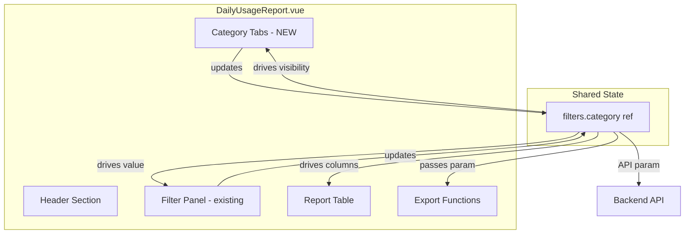
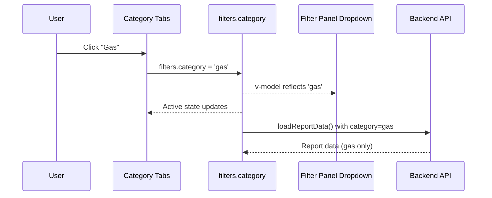

# Design Document: Laporan Harian Kategori

## Overview

Fitur ini menambahkan komponen pemilih kategori yang menonjol (prominent category selector) pada halaman Laporan Daily Usage. Saat ini, filter kategori hanya tersedia di dalam panel filter yang harus dibuka terlebih dahulu. Perubahan ini menampilkan tab/tombol kategori langsung di halaman utama, antara header dan tabel, sehingga pengguna dapat beralih cepat antara laporan Gas, Air, dan Listrik.

### Design Decisions

1. **Inline tab component (bukan komponen terpisah)**: Pilihan kategori diimplementasikan sebagai bagian dari `DailyUsageReport.vue` menggunakan elemen `<button>` dengan conditional styling. Tidak perlu komponen Vue terpisah karena logikanya sederhana dan hanya digunakan di satu tempat.

2. **Single reactive ref sebagai source of truth**: `filters.category` tetap menjadi single source of truth. Baik tab maupun dropdown filter merujuk dan memperbarui ref yang sama, sehingga sinkronisasi otomatis tanpa watcher tambahan.

3. **No backend changes**: Backend API sudah mendukung parameter `category` (nullable, in: gas, water, electricity). Fitur ini murni perubahan frontend.

4. **Tailwind utility classes untuk responsif**: Menggunakan Tailwind responsive breakpoints (`sm:`, `md:`) untuk memastikan tab responsif tanpa CSS custom.

5. **Urutan kategori**: Mengikuti requirements — "Semua Kategori" pertama, lalu "Gas", "Air", "Listrik" sesuai urutan enum backend.

## Architecture



### Interaction Flow



## Components and Interfaces

### Category Tabs (inline dalam DailyUsageReport.vue)

```typescript
// Definisi opsi kategori
const categoryOptions = [
  { value: '', label: 'Semua Kategori', icon: null },
  { value: 'gas', label: 'Gas', icon: Flame },
  { value: 'water', label: 'Air', icon: Droplets },
  { value: 'electricity', label: 'Listrik', icon: Zap },
]

// Handler pemilihan kategori
const selectCategory = (categoryValue: string) => {
  filters.value.category = categoryValue
  handleFilterChange() // Trigger API reload
}
```

### Template Structure

```html
<!-- Category Tabs - ditempatkan setelah Alert, sebelum empty state / table -->
<div class="flex flex-wrap gap-2">
  <button
    v-for="option in categoryOptions"
    :key="option.value"
    @click="selectCategory(option.value)"
    :class="[
      'inline-flex items-center gap-2 px-4 py-2.5 rounded-lg text-sm font-medium transition-all duration-200',
      filters.category === option.value
        ? 'bg-blue-600 text-white shadow-sm'
        : 'bg-white text-gray-700 border border-gray-300 hover:bg-gray-50'
    ]"
  >
    <component :is="option.icon" v-if="option.icon" :size="16" />
    {{ option.label }}
  </button>
</div>
```

### Placement in Page Layout

```
┌─────────────────────────────────────────┐
│ Header (Judul + Tombol Export/Filter)    │
├─────────────────────────────────────────┤
│ Alert (jika ada)                         │
├─────────────────────────────────────────┤
│ [Semua] [Gas] [Air] [Listrik]  ← NEW   │
├─────────────────────────────────────────┤
│ Filter Panel (collapsible, existing)     │
├─────────────────────────────────────────┤
│ Empty State / Report Table               │
└─────────────────────────────────────────┘
```

### Synchronization Mechanism

Tidak diperlukan watcher atau event bus karena kedua kontrol (tabs dan dropdown) menggunakan `filters.category` sebagai source of truth:

- **Tab → filters.category**: `@click="selectCategory(value)"` langsung set `filters.category`
- **Dropdown → filters.category**: `v-model="filters.category"` + `@change="handleFilterChange"` sudah ada
- **filters.category → Tab styling**: Template `:class` binding membaca `filters.category` secara reaktif
- **filters.category → Dropdown value**: `v-model` binding sudah otomatis

## Data Models

### Category Options Array

```typescript
interface CategoryOption {
  value: '' | 'gas' | 'water' | 'electricity'
  label: string
  icon: Component | null
}
```

### Existing Filters Ref (tidak berubah)

```typescript
interface Filters {
  user_id: string
  branch_id: string
  month: string
  start_date: string
  end_date: string
  category: '' | 'gas' | 'water' | 'electricity'
}
```

### Column Visibility Logic (sudah ada, tidak berubah)

```typescript
// Gas columns: visible when category === '' || category === 'gas'
// Water columns: visible when category === '' || category === 'water'  
// Electricity columns: visible when category === '' || category === 'electricity'
```

## Correctness Properties

*A property is a characteristic or behavior that should hold true across all valid executions of a system—essentially, a formal statement about what the system should do. Properties serve as the bridge between human-readable specifications and machine-verifiable correctness guarantees.*

### Property 1: Bidirectional category synchronization

*For any* valid category value (from the set {'', 'gas', 'water', 'electricity'}), updating `filters.category` from either the tab buttons or the dropdown filter SHALL result in both UI controls reflecting the same value simultaneously.

**Validates: Requirements 1.5, 3.1, 3.2, 3.4**

### Property 2: Category selection drives correct API parameter

*For any* valid category value selected via the tabs, the subsequent API call to `/daily-records/report/daily-usage` SHALL include the `category` parameter matching the selected value, or omit it entirely when the value is empty.

**Validates: Requirements 1.3**

### Property 3: Exclusive active tab indicator

*For any* category selection, exactly one tab button SHALL have the active visual styling class applied, and all other tabs SHALL have the inactive styling class.

**Validates: Requirements 1.4**

### Property 4: Common columns invariant

*For any* value of `filters.category`, the table SHALL always render the five common columns (Timestamp, Tanggal, Nama, Outlet, Total Customer) regardless of which category is active.

**Validates: Requirements 4.1**

### Property 5: Electricity rowspan calculation

*For any* electricity meter array with length > 1, the `getElectricityRowspan` function SHALL return the array length plus 1 (for the TOTAL row). For arrays with length ≤ 1, it SHALL return 1.

**Validates: Requirements 4.6**

### Property 6: Colspan matches visible columns

*For any* valid category value, the `getColspan` function SHALL return the sum of common columns (5) plus the column count for each visible category group (gas: 7, water: 5, electricity: 11 when shown).

**Validates: Requirements 4.7**

### Property 7: Export passes correct category parameter

*For any* export operation (Excel or PDF), the API request SHALL include `category` with the currently selected value, or 'all' when no specific category is selected.

**Validates: Requirements 5.1, 5.2, 5.3**

## Error Handling

| Scenario | Handling |
|----------|----------|
| Cabang belum dipilih | Tampilkan empty state. Tabs tetap interaktif, pilihan disimpan di `filters.category`. Data tidak dimuat sampai cabang dipilih. |
| API error saat load data | Tampilkan Alert dengan pesan error dari API. `reportData` dikosongkan. Tabs tetap aktif untuk retry. |
| Export gagal | Tampilkan Alert error. File tidak diunduh. User bisa coba lagi. |
| Network timeout | Loading state ditampilkan. Error ditangkap di catch block dan ditampilkan via Alert. |

## Testing Strategy

### Unit Tests (Vitest + Vue Test Utils)

Unit tests fokus pada skenario spesifik dan edge case:

1. **Initial render**: Verifikasi tabs muncul dengan 4 opsi dan "Semua" aktif secara default
2. **Tab click**: Klik tab "Gas" → verify `filters.category` = 'gas' dan `loadReportData` dipanggil
3. **Empty branch state**: Tabs tetap rendered dan clickable meski belum ada branch
4. **Column visibility**: Per-kategori snapshot test untuk kolom yang ditampilkan
5. **Export error handling**: Mock API error → verify error message ditampilkan

### Property-Based Tests (fast-check)

Property-based tests menggunakan library **fast-check** untuk memverifikasi properti universal:

- Minimum **100 iterasi** per property test
- Setiap test ditandai dengan referensi ke property di design document
- Tag format: **Feature: laporan-harian-kategori, Property {number}: {property_text}**

Properties yang ditest:
1. Bidirectional sync (Property 1)
2. API parameter correctness (Property 2)
3. Exclusive active indicator (Property 3)
4. Common columns invariant (Property 4)
5. Rowspan calculation (Property 5)
6. Colspan calculation (Property 6)
7. Export category parameter (Property 7)

### Integration / Visual Tests

- Responsive layout pada viewport < 768px (visual regression)
- Tab interaction end-to-end dengan API mock
- Filter panel sync saat dibuka/ditutup

### Test Balance

- **Property tests**: Memverifikasi logika universal (sync, calculations, invariants)
- **Unit tests**: Memverifikasi skenario spesifik (initial state, error handling, edge cases)
- **Visual/Integration tests**: Memverifikasi responsive layout dan real DOM behavior
