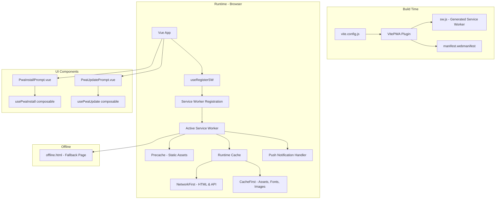
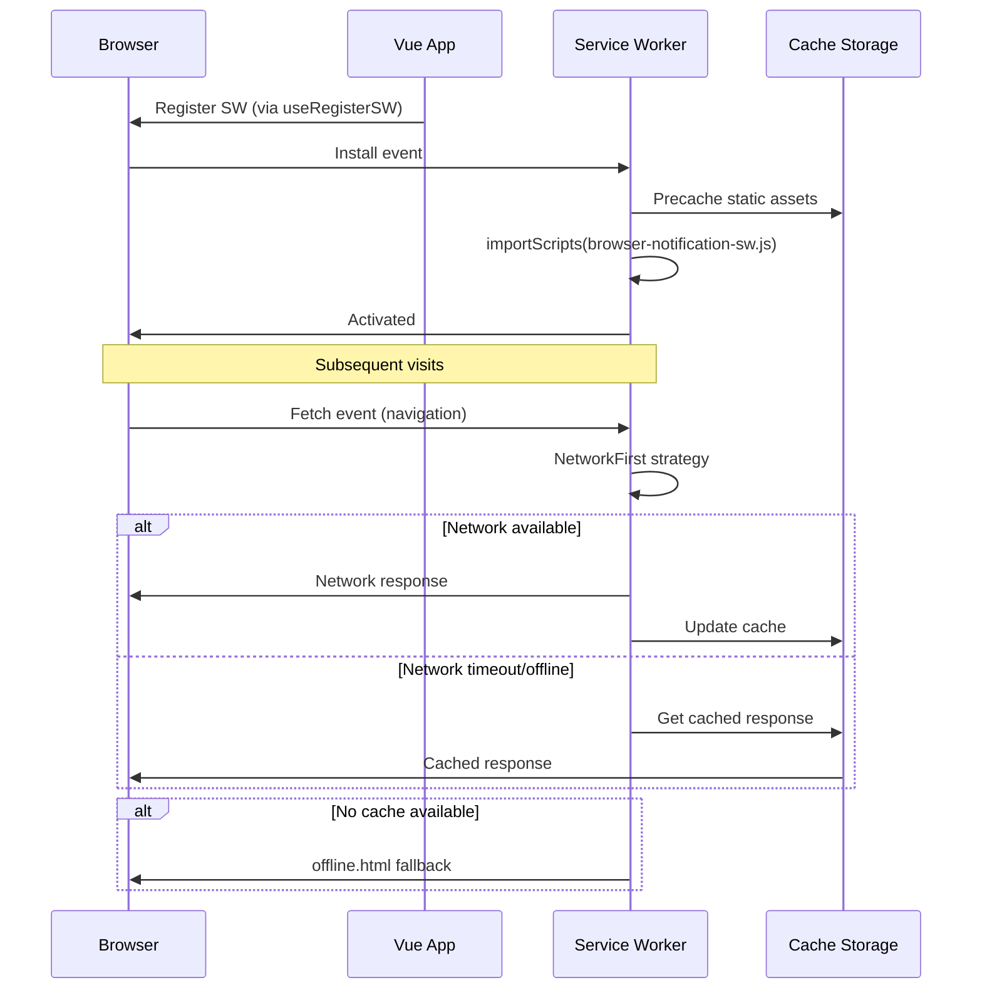

# Design Document: PWA Frontend

## Overview

Dokumen ini mendeskripsikan desain teknis untuk menambahkan dukungan Progressive Web App (PWA) pada aplikasi frontend "GA Maintenance". Implementasi menggunakan `vite-plugin-pwa` yang mengintegrasikan Workbox dengan pipeline build Vite 6 untuk menghasilkan service worker dan web app manifest secara otomatis.

### Keputusan Desain Utama

1. **Strategi `generateSW`** dipilih dibanding `injectManifest` karena kebutuhan caching bersifat standar dan tidak memerlukan custom logic di service worker. Workbox menghasilkan service worker secara otomatis berdasarkan konfigurasi.

2. **`registerType: 'prompt'`** dipilih agar pengguna memiliki kontrol penuh kapan update diterapkan, menghindari reload tak terduga saat pengguna sedang bekerja.

3. **Integrasi push notification via `importScripts`** — file `browser-notification-sw.js` yang sudah ada di-import ke service worker PWA melalui opsi `importScripts` Workbox, sehingga satu service worker menangani baik caching maupun push notification tanpa konflik scope.

4. **Offline fallback sebagai file statis** — halaman offline dibuat sebagai HTML self-contained dengan inline styling agar tidak bergantung pada resource eksternal.

5. **Composable pattern** (`usePwaInstall`, `usePwaUpdate`) mengikuti konvensi proyek yang sudah ada (`useBrowserNotifications.js`) untuk konsistensi arsitektur.

## Architecture

### Diagram Arsitektur



### Alur Registrasi Service Worker



## Components and Interfaces

### 1. Konfigurasi Plugin (`vite.config.js`)

Plugin `VitePWA` ditambahkan ke array plugins bersama `@vitejs/plugin-vue`:

```javascript
import { VitePWA } from 'vite-plugin-pwa'

export default defineConfig(({ mode }) => {
  // ... existing config
  return {
    plugins: [
      vue(),
      VitePWA({
        registerType: 'prompt',
        strategies: 'generateSW',
        manifest: { /* manifest config */ },
        workbox: {
          importScripts: ['/browser-notification-sw.js'],
          navigateFallback: '/offline.html',
          navigateFallbackDenylist: [/^\/api\//],
          runtimeCaching: [ /* caching strategies */ ],
        },
      }),
    ],
  }
})
```

### 2. Composable: `usePwaInstall`

**Path:** `src/composables/usePwaInstall.js`

```javascript
// Interface
export function usePwaInstall() {
  return {
    isInstallable,      // Ref<boolean> - apakah prompt tersedia
    isStandalone,       // Ref<boolean> - apakah app berjalan di mode standalone
    promptInstall,      // () => Promise<void> - trigger install prompt
    dismissInstall,     // () => void - sembunyikan tanpa install
  }
}
```

**Tanggung jawab:**
- Menangkap dan menyimpan event `beforeinstallprompt`
- Mendeteksi mode standalone via `matchMedia('(display-mode: standalone)')`
- Memanggil `prompt()` pada event yang tersimpan saat user mengklik install
- Mendengarkan event `appinstalled` untuk cleanup
- Menampilkan toast error via `vue-sonner` jika prompt tidak valid

### 3. Composable: `usePwaUpdate`

**Path:** `src/composables/usePwaUpdate.js`

Composable ini memanfaatkan `useRegisterSW` dari `virtual:pwa-register/vue`:

```javascript
// Interface
export function usePwaUpdate() {
  return {
    needRefresh,        // Ref<boolean> - apakah ada update tersedia
    offlineReady,       // Ref<boolean> - apakah app siap offline
    updateApp,          // () => Promise<void> - apply update dan reload
    dismissUpdate,      // () => void - dismiss notifikasi update
    updateDismissed,    // Ref<boolean> - apakah user sudah dismiss
  }
}
```

**Tanggung jawab:**
- Wrapper di atas `useRegisterSW` dari vite-plugin-pwa
- Mengelola state `needRefresh` dan `offlineReady`
- Mengirim pesan `SKIP_WAITING` ke waiting service worker saat update
- Melakukan reload halaman setelah update dengan timeout 5 detik
- Menampilkan error toast jika reload gagal
- Reset `updateDismissed` pada route change (via `router.afterEach`)

### 4. Komponen UI: `PwaInstallPrompt.vue`

**Path:** `src/components/app/PwaInstallPrompt.vue`

```vue
<!-- Menampilkan banner/tombol install jika isInstallable && !isStandalone -->
<template>
  <div v-if="isInstallable && !isStandalone" class="...">
    <button @click="promptInstall">Install Aplikasi</button>
    <button @click="dismissInstall">✕</button>
  </div>
</template>
```

### 5. Komponen UI: `PwaUpdatePrompt.vue`

**Path:** `src/components/app/PwaUpdatePrompt.vue`

```vue
<!-- Toast persistent menggunakan vue-sonner pattern -->
<template>
  <div v-if="needRefresh && !updateDismissed" class="..." role="alert">
    <p>Versi baru tersedia</p>
    <button @click="updateApp">Perbarui</button>
    <button @click="dismissUpdate">Nanti</button>
  </div>
</template>
```

### 6. Offline Fallback Page

**Path:** `public/offline.html`

File HTML statis self-contained dengan inline CSS. Menampilkan:
- Nama aplikasi "GA Maintenance"
- Pesan offline
- Tombol reload (`window.location.reload()`)

### 7. Integrasi di `App.vue`

```vue
<template>
  <RouterView />
  <ToastContainer />
  <PwaInstallPrompt />
  <PwaUpdatePrompt />
</template>
```

## Data Models

### Service Worker State

```typescript
interface PwaInstallState {
  deferredPrompt: BeforeInstallPromptEvent | null  // Event tersimpan
  isInstallable: boolean                            // Prompt tersedia
  isStandalone: boolean                             // Mode standalone aktif
}

interface PwaUpdateState {
  needRefresh: boolean        // Update tersedia
  offlineReady: boolean       // SW siap offline
  updateDismissed: boolean    // User sudah klik "Nanti"
  registration: ServiceWorkerRegistration | null
}
```

### Web App Manifest Schema

```typescript
interface WebAppManifest {
  name: "GA Maintenance"
  short_name: "GA Maint"
  description: string         // 10-200 karakter, mengandung "helpdesk"/"maintenance"
  theme_color: string         // Format "#RRGGBB"
  background_color: string    // Format "#RRGGBB"
  display: "standalone"
  start_url: "/"
  scope: "/"
  icons: ManifestIcon[]
}

interface ManifestIcon {
  src: string
  sizes: "192x192" | "512x512"
  type: "image/png"
  purpose?: "maskable" | "any"
}
```

### Runtime Cache Configuration

| Pattern | Strategy | Timeout | Max Entries | Max Age |
|---------|----------|---------|-------------|---------|
| Navigation (HTML) | NetworkFirst | 3s | - | - |
| Static Assets (JS/CSS) | CacheFirst | - | 60 | 30 hari |
| Google Fonts | CacheFirst | - | 30 | 365 hari |
| API (`/api/*`) | NetworkFirst | 5s | 100 | 7 hari |
| Images | CacheFirst | - | 100 | 30 hari |

## Correctness Properties

*A property is a characteristic or behavior that should hold true across all valid executions of a system — essentially, a formal statement about what the system should do. Properties serve as the bridge between human-readable specifications and machine-verifiable correctness guarantees.*

### Property 1: Install prompt event capture mengubah state

*For any* valid `BeforeInstallPromptEvent` yang diterima browser, setelah event di-dispatch, `isInstallable` harus bernilai `true` dan referensi event tersimpan harus sama dengan event yang diterima.

**Validates: Requirements 6.1**

### Property 2: Visibilitas tombol install adalah fungsi dari state

*For any* kombinasi state `(isInstallable, isStandalone)`, tombol install harus terlihat jika dan hanya jika `isInstallable === true` DAN `isStandalone === false`.

**Validates: Requirements 6.2, 6.6**

### Property 3: Event appinstalled membersihkan semua state install

*For any* state dimana `deferredPrompt` non-null dan `isInstallable` bernilai `true`, ketika event `appinstalled` diterima, maka `isInstallable` harus menjadi `false` dan `deferredPrompt` harus menjadi `null`.

**Validates: Requirements 6.4**

### Property 4: Dismiss update tidak memicu side effect

*For any* state dimana `needRefresh === true`, memanggil `dismissUpdate` harus mengubah `updateDismissed` menjadi `true` tanpa memanggil `updateServiceWorker` dan tanpa melakukan reload halaman.

**Validates: Requirements 7.5**

### Property 5: Navigasi route me-reset state dismissed

*For any* state dimana `updateDismissed === true` dan `needRefresh === true`, setelah event navigasi route terjadi, `updateDismissed` harus kembali menjadi `false` sehingga update prompt ditampilkan kembali.

**Validates: Requirements 7.7**

## Error Handling

### Service Worker Registration Errors

| Skenario | Penanganan |
|----------|------------|
| Browser tidak support service worker | Composable mengembalikan state default (isInstallable=false), UI tidak ditampilkan |
| Import `browser-notification-sw.js` gagal | Service worker tetap berjalan untuk caching/offline (Workbox isolates importScripts errors) |
| Registrasi service worker gagal | Error di-log ke Sentry, aplikasi tetap berfungsi tanpa PWA features |

### Install Prompt Errors

| Skenario | Penanganan |
|----------|------------|
| `prompt()` dipanggil saat event null | Toast error ditampilkan: "Instalasi tidak dapat dilakukan saat ini", tombol install disembunyikan |
| `prompt()` throws exception | Error di-catch, toast error ditampilkan, state di-reset |

### Update Prompt Errors

| Skenario | Penanganan |
|----------|------------|
| Reload gagal dalam 5 detik setelah SKIP_WAITING | Toast error: "Pembaruan gagal. Silakan reload halaman secara manual" |
| `updateServiceWorker()` throws | Error di-catch, toast error ditampilkan, prompt tetap visible |
| Service worker waiting state hilang | `needRefresh` di-reset ke false, prompt tersembunyi |

### Network/Caching Errors

| Skenario | Penanganan |
|----------|------------|
| Semua cache miss + offline | `offline.html` ditampilkan untuk navigation requests |
| API cache miss + offline | Request gagal, error handling di layer axios (existing) |
| Cache storage penuh | Workbox ExpirationPlugin otomatis membersihkan entry lama berdasarkan maxEntries |

## Testing Strategy

### Unit Tests (Vitest + Vue Test Utils)

Unit tests fokus pada specific examples, edge cases, dan verifikasi konfigurasi:

1. **Konfigurasi manifest** — Verifikasi semua field manifest sesuai requirements (name, short_name, description, colors, icons, display, scope, start_url)
2. **Konfigurasi runtime caching** — Verifikasi setiap rule memiliki strategy, timeout, dan expiration yang benar
3. **Konfigurasi workbox** — Verifikasi importScripts, navigateFallback, navigateFallbackDenylist
4. **Offline fallback content** — Verifikasi HTML berisi "GA Maintenance", pesan offline, tombol reload, inline styling, tanpa external resources
5. **Install prompt — prompt() saat event null** — Verifikasi toast error ditampilkan
6. **Install prompt — user dismisses** — Verifikasi state berubah ke not installable
7. **Update prompt — klik "Perbarui"** — Verifikasi updateServiceWorker dipanggil
8. **Update prompt — reload timeout** — Verifikasi error toast setelah 5 detik
9. **Komponen rendering** — Verifikasi PwaInstallPrompt dan PwaUpdatePrompt render dengan benar berdasarkan state

### Property-Based Tests (Vitest + fast-check)

Property-based tests memverifikasi universal properties dengan minimum 100 iterasi per test:

Library: **fast-check** (sudah ada di devDependencies)

Konfigurasi: Minimum 100 iterations per property test.

Tag format: `Feature: pwa-frontend, Property {number}: {property_text}`

1. **Property 1** — Generate random BeforeInstallPromptEvent-like objects, verify state transition
2. **Property 2** — Generate random boolean combinations (isInstallable, isStandalone), verify button visibility invariant
3. **Property 3** — Generate random states with non-null deferredPrompt, fire appinstalled, verify cleanup
4. **Property 4** — Generate random states with needRefresh=true, call dismissUpdate, verify no side effects
5. **Property 5** — Generate random states with (updateDismissed=true, needRefresh=true), simulate route change, verify reset

### Integration Tests

1. **Build output** — Run `vite build` dan verifikasi `sw.js` + `manifest.webmanifest` ada di `dist/`
2. **Push notification** — Simulasi push event di service worker, verifikasi notifikasi ditampilkan
3. **Offline behavior** — Simulasi offline state, verifikasi fallback page ditampilkan

### Test File Structure

```
tests/
├── unit/
│   ├── pwa-config.spec.js          # Manifest & workbox config tests
│   ├── pwa-offline.spec.js         # Offline fallback content tests
│   ├── usePwaInstall.spec.js       # Install composable unit tests
│   └── usePwaUpdate.spec.js        # Update composable unit tests
├── properties/
│   ├── pwa-install.property.spec.js  # Property tests for install flow
│   └── pwa-update.property.spec.js   # Property tests for update flow
└── integration/
    └── pwa-build.spec.js            # Build output verification
```

