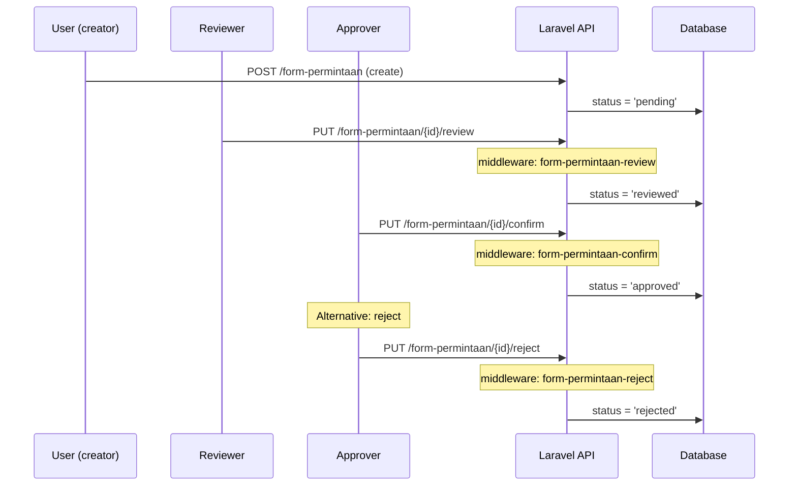
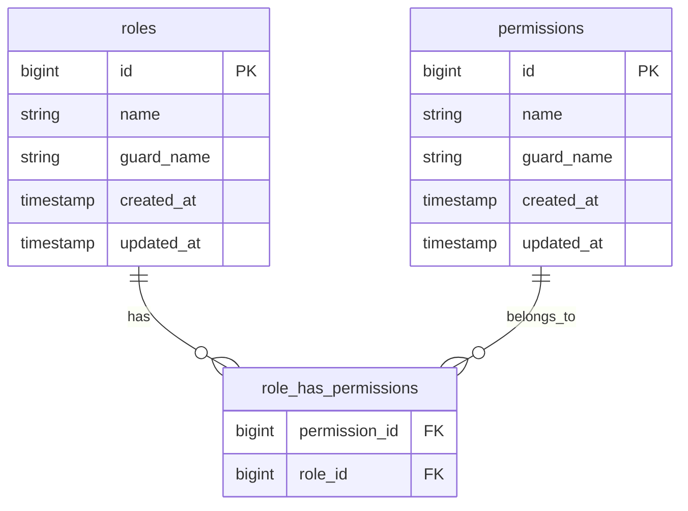

# Design Document: Role & Permission untuk Fitur Permintaan

## Overview

Fitur ini menambahkan 4 permission baru (`form-permintaan-review`, `form-permintaan-reject`, `form-permintaan-edit`, `form-permintaan-delete`) dan 2 role baru (`approver-permintaan`, `reviewer-permintaan`) untuk mendukung workflow approval pada Form Permintaan. Perubahan mencakup backend (seeder, middleware) dan frontend (permissionConfig.js).

### Design Decisions

1. **Extend existing seeder pattern**: Permission baru ditambahkan ke array `$permissions` di `PermissionSeeder.php` menggunakan prefix-based pattern yang sudah ada (`'form-permintaan' => [...]`). Ini menjaga konsistensi dengan ~70 permission yang sudah terdaftar.

2. **Role baru bukan SYSTEM_ROLES**: Role `approver-permintaan` dan `reviewer-permintaan` tidak dimasukkan ke `SYSTEM_ROLES` constant sehingga admin dapat mengedit/hapus role ini melalui UI Role Management.

3. **Middleware per-action di controller**: Menggunakan pattern `Middleware::using()` yang sudah ada di `FormPermintaanController::middleware()` untuk menambahkan proteksi permission pada action `update`, `destroy`, dan endpoint baru `review`/`reject`.

4. **Endpoint review sebagai route baru**: Karena belum ada endpoint review di routes saat ini, ditambahkan `PUT /form-permintaan/{id}/review` sebagai endpoint baru. Endpoint reject ditambahkan sebagai `PUT /form-permintaan/{id}/reject`.

5. **Pisahkan middleware update dan delete**: Saat ini `update` dan `destroy` menggunakan permission `form-permintaan-create`. Setelah perubahan, `update` menggunakan `form-permintaan-edit` dan `destroy` menggunakan `form-permintaan-delete` untuk granularitas yang lebih tinggi.

## Architecture

```mermaid
graph TD
    subgraph Frontend [Vue 3 - permissionConfig.js]
        FG[featureGroups.formPermintaan]
        PD[permissionDependencies]
        RP[rolePresets]
    end

    subgraph Backend [Laravel API]
        PS[PermissionSeeder]
        RS[RoleSeeder]
        FPC[FormPermintaanController]
        MW[Spatie PermissionMiddleware]
        DB[(MySQL - Spatie Tables)]
    end

    PS -->|firstOrCreate| DB
    RS -->|syncPermissions| DB
    FPC -->|middleware()| MW
    MW -->|check permission| DB
    FG -->|render toggles| RP
    PD -->|auto-resolve| FG
```

### Workflow Approval Flow



## Components and Interfaces

### Backend Components

#### PermissionSeeder (Updated)

```php
// Perubahan pada array $permissions:
'form-permintaan' => [
    'menu',
    'create',
    'list',
    'confirm',
    'view-all',
    'review',    // BARU
    'reject',    // BARU
    'edit',      // BARU
    'delete',    // BARU
],
```

#### RoleSeeder (Updated)

```php
// Penambahan role baru:
$approverPermintaan = Role::firstOrCreate([
    'name' => 'approver-permintaan',
    'guard_name' => 'sanctum'
]);
$approverPermintaan->syncPermissions([
    'form-permintaan-menu',
    'form-permintaan-list',
    'form-permintaan-confirm',
    'form-permintaan-view-all',
    'form-permintaan-reject',
]);

$reviewerPermintaan = Role::firstOrCreate([
    'name' => 'reviewer-permintaan',
    'guard_name' => 'sanctum'
]);
$reviewerPermintaan->syncPermissions([
    'form-permintaan-menu',
    'form-permintaan-list',
    'form-permintaan-review',
    'form-permintaan-view-all',
]);

// Update existing roles:
// - admin: tambah form-permintaan-review, reject, edit, delete
// - staff: tambah form-permintaan-reject
// - user: TIDAK ditambahkan permission baru
// - superadmin: otomatis dapat semua via $allPermissions
```

#### FormPermintaanController::middleware() (Updated)

```php
public static function middleware()
{
    return [
        new Middleware(PermissionMiddleware::using(['form-permintaan-list']), only: ['index', 'show', 'downloadPdf']),
        new Middleware(PermissionMiddleware::using(['form-permintaan-confirm']), only: ['confirm']),
        new Middleware(PermissionMiddleware::using(['form-permintaan-create']), only: ['store', 'uploadAttachment', 'downloadAttachment', 'deleteAttachment']),
        new Middleware(PermissionMiddleware::using(['form-permintaan-edit']), only: ['update']),       // BARU
        new Middleware(PermissionMiddleware::using(['form-permintaan-delete']), only: ['destroy']),    // BARU
        new Middleware(PermissionMiddleware::using(['form-permintaan-review']), only: ['review']),     // BARU
        new Middleware(PermissionMiddleware::using(['form-permintaan-reject']), only: ['reject']),     // BARU
    ];
}
```

#### New Controller Methods

```php
public function review(string $id): JsonResponse
{
    // Set status = 'reviewed', record reviewed_by
}

public function reject(Request $request, string $id): JsonResponse
{
    // Set status = 'rejected', record rejected_by, optional rejection_reason
}
```

#### New Routes

```php
// Ditambahkan di routes/api.php:
Route::put('form-permintaan/{id}/review', [FormPermintaanController::class, 'review']);
Route::put('form-permintaan/{id}/reject', [FormPermintaanController::class, 'reject']);
```

### Frontend Components

#### permissionConfig.js Updates

**featureGroups.formPermintaan.permissions** — tambah 4 entry:

```javascript
"form-permintaan-review": {
    label: "Review Form",
    description: "Mereview form permintaan sebelum disetujui"
},
"form-permintaan-reject": {
    label: "Tolak Form",
    description: "Menolak form permintaan"
},
"form-permintaan-edit": {
    label: "Edit Form",
    description: "Mengedit form permintaan yang sudah dibuat"
},
"form-permintaan-delete": {
    label: "Hapus Form",
    description: "Menghapus form permintaan"
}
```

**permissionDependencies** — tambah 4 entry:

```javascript
"form-permintaan-review": ["form-permintaan-list", "form-permintaan-menu"],
"form-permintaan-reject": ["form-permintaan-list", "form-permintaan-menu"],
"form-permintaan-edit": ["form-permintaan-list", "form-permintaan-menu"],
"form-permintaan-delete": ["form-permintaan-list", "form-permintaan-menu"],
```

**rolePresets** — tambah 2 preset baru dan update staff:

```javascript
"approver-permintaan": {
    label: "Approver Permintaan",
    description: "Menyetujui atau menolak form permintaan",
    icon: "CheckCircle",
    permissions: [
        "form-permintaan-menu",
        "form-permintaan-list",
        "form-permintaan-confirm",
        "form-permintaan-view-all",
        "form-permintaan-reject"
    ]
},
"reviewer-permintaan": {
    label: "Reviewer Permintaan",
    description: "Mereview form permintaan sebelum approval",
    icon: "Eye",
    permissions: [
        "form-permintaan-menu",
        "form-permintaan-list",
        "form-permintaan-review",
        "form-permintaan-view-all"
    ]
}

// Update staff preset: tambah "form-permintaan-reject"
```

### API Interfaces

#### PUT /api/v1/form-permintaan/{id}/review

**Request:** None (body opsional)

**Response (200):**
```json
{
    "success": true,
    "message": "Form permintaan berhasil direview",
    "data": { /* FormPermintaan resource */ }
}
```

**Error (403):**
```json
{
    "success": false,
    "message": "Anda tidak memiliki izin untuk melakukan aksi ini."
}
```

#### PUT /api/v1/form-permintaan/{id}/reject

**Request:**
```json
{
    "reason": "Alasan penolakan (opsional)"
}
```

**Response (200):**
```json
{
    "success": true,
    "message": "Form permintaan berhasil ditolak",
    "data": { /* FormPermintaan resource */ }
}
```

## Data Models

### Existing Schema (No Migration Required for Permission/Role)

Menggunakan tabel Spatie Permission yang sudah ada:



### Permission Matrix (After Implementation)

| Permission | superadmin | admin | staff | user | approver-permintaan | reviewer-permintaan |
|---|:---:|:---:|:---:|:---:|:---:|:---:|
| form-permintaan-menu | ✓ | ✓ | ✓ | ✓ | ✓ | ✓ |
| form-permintaan-list | ✓ | ✓ | ✓ | ✓ | ✓ | ✓ |
| form-permintaan-create | ✓ | ✓ | — | ✓ | — | — |
| form-permintaan-confirm | ✓ | ✓ | ✓ | — | ✓ | — |
| form-permintaan-view-all | ✓ | ✓ | ✓ | — | ✓ | ✓ |
| form-permintaan-review | ✓ | ✓ | — | — | — | ✓ |
| form-permintaan-reject | ✓ | ✓ | ✓ | — | ✓ | — |
| form-permintaan-edit | ✓ | ✓ | — | — | — | — |
| form-permintaan-delete | ✓ | ✓ | — | — | — | — |

### Frontend Config Data Structure

```typescript
// Tipe untuk role preset baru
interface RolePreset {
    label: string;
    description: string;
    icon: string;       // Lucide icon name
    permissions: string[];
}

// Contoh:
// rolePresets['approver-permintaan']: RolePreset
// rolePresets['reviewer-permintaan']: RolePreset
```

## Correctness Properties

*A property is a characteristic or behavior that should hold true across all valid executions of a system — essentially, a formal statement about what the system should do. Properties serve as the bridge between human-readable specifications and machine-verifiable correctness guarantees.*

### Property 1: Seeder idempotence

*For any* role in the system (including `approver-permintaan` and `reviewer-permintaan`), running the RoleSeeder and PermissionSeeder multiple times SHALL produce an identical permission assignment state — the set of permissions for each role after N executions must equal the set after 1 execution.

**Validates: Requirements 2.4, 6.5**

### Property 2: Permission middleware enforcement

*For any* protected endpoint (`review`, `reject`, `update`, `destroy`) and *for any* authenticated user, if the user does NOT have the required permission for that endpoint, the API SHALL return HTTP 403 without executing controller logic. Conversely, if the user HAS the required permission, the request SHALL proceed to controller logic.

**Validates: Requirements 7.1, 7.2, 7.3, 7.4, 7.5, 7.7**

### Property 3: Unauthenticated access rejection

*For any* protected form-permintaan endpoint, a request without a valid Sanctum token SHALL receive HTTP 401 regardless of which endpoint is accessed.

**Validates: Requirements 7.6**

### Property 4: Dependency auto-resolution for new permissions

*For any* of the new permissions (`form-permintaan-review`, `form-permintaan-reject`, `form-permintaan-edit`, `form-permintaan-delete`), when toggled ON in the Permission Manager, the system SHALL automatically activate `form-permintaan-list` and `form-permintaan-menu` as dependencies.

**Validates: Requirements 4.5, 4.6, 4.7, 4.8, 4.10**

### Property 5: Preset application correctness

*For any* of the new role presets (`approver-permintaan`, `reviewer-permintaan`), applying the preset SHALL result in `selectedPermissions` containing exactly the permissions defined in that preset's configuration, plus their transitive dependencies (which in this case are already included in the preset lists).

**Validates: Requirements 5.2, 5.3, 5.5**

## Error Handling

### API Error Responses

| Scenario | HTTP Code | Response |
|----------|-----------|----------|
| User tanpa permission mengakses endpoint | 403 | `{ "success": false, "message": "Anda tidak memiliki izin untuk melakukan aksi ini." }` |
| User tidak terautentikasi | 401 | `{ "success": false, "message": "Unauthenticated." }` |
| Form permintaan tidak ditemukan | 404 | `{ "success": false, "message": "Form permintaan tidak ditemukan." }` |
| Review/reject/confirm pada form yang bukan pending | 422 | `{ "success": false, "message": "Hanya form permintaan dengan status pending yang dapat diproses." }` |
| Server error | 500 | `{ "success": false, "message": "Terjadi kesalahan server." }` |

### Frontend Error Handling

| Scenario | UI Behavior |
|----------|-------------|
| Toggle permission yang di-lock oleh dependency | Menampilkan warning badge menjelaskan permission mana yang mengunci |
| Preset tidak bisa diterapkan (network error) | Toast error dengan opsi retry |
| Permission baru belum tersedia di backend (stale data) | Menampilkan pesan bahwa permission belum terdaftar, arahkan admin untuk run seeder |

## Testing Strategy

### Testing Approach

**Unit Tests (Example-based)** — untuk verifikasi konfigurasi statis dan behavior spesifik:

- **Backend (PHPUnit)**:
  - Verifikasi PermissionSeeder mendaftarkan 4 permission baru
  - Verifikasi RoleSeeder membuat role `approver-permintaan` dan `reviewer-permintaan` dengan permission yang benar
  - Verifikasi permission assignment per role sesuai matrix
  - Verifikasi middleware menolak akses tanpa permission (per endpoint)
  - Verifikasi middleware mengizinkan akses dengan permission yang benar

- **Frontend (Vitest)**:
  - Verifikasi `featureGroups.formPermintaan` memiliki 9 permission entries
  - Verifikasi `permissionDependencies` memiliki 4 entry baru
  - Verifikasi `rolePresets` memiliki `approver-permintaan` dan `reviewer-permintaan`
  - Verifikasi preset `staff` memiliki `form-permintaan-reject`

**Property-Based Tests (fast-check + Vitest)** — untuk verifikasi universal properties:

- Dependency resolution: untuk setiap permission baru, toggle ON harus auto-enable dependencies
- Preset application: untuk setiap preset baru, apply harus menghasilkan exact permission set
- Minimum 100 iterations per property test
- Tag format: **Feature: role-fitur-permintaan, Property {N}: {description}**

**Integration Tests (PHPUnit)** — untuk verifikasi end-to-end:

- Seeder idempotence: jalankan seeder 2x, verifikasi state identik
- Full flow: create user dengan role approver → akses endpoint confirm → 200
- Full flow: create user dengan role reviewer → akses endpoint review → 200
- Full flow: create user dengan role reviewer → akses endpoint confirm → 403

### PBT Library

- **Frontend**: `fast-check` dengan Vitest (sudah digunakan di spec `role-permission-management`)
- **Backend**: PHPUnit data providers untuk parameterized testing

### Test File Structure

```
api/tests/Feature/
    FormPermintaanPermissionTest.php       # Middleware protection tests
    FormPermintaanSeederTest.php           # Seeder correctness & idempotence

fe/tests/
    config/
        permissionConfig.formPermintaan.test.js   # Config structure tests
    composables/
        formPermintaanDependency.property.test.js # PBT for dependency resolution
```
