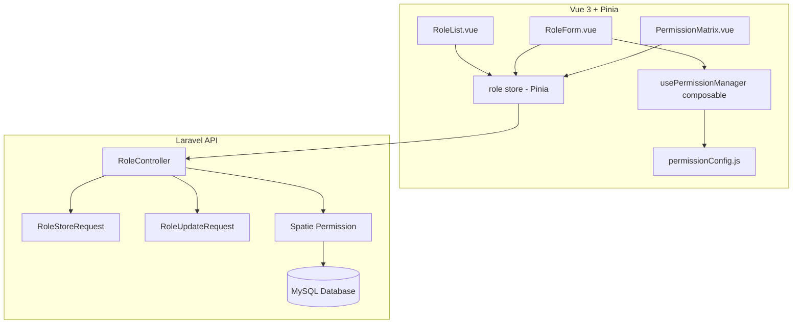
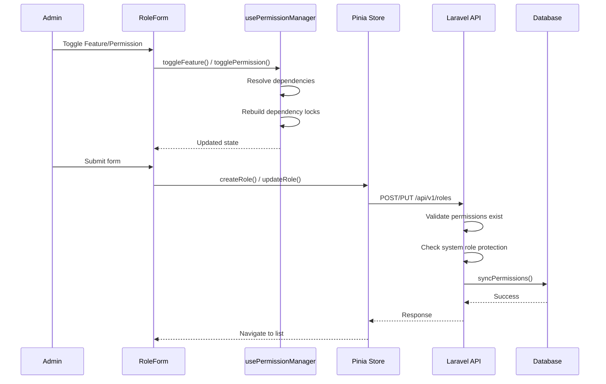
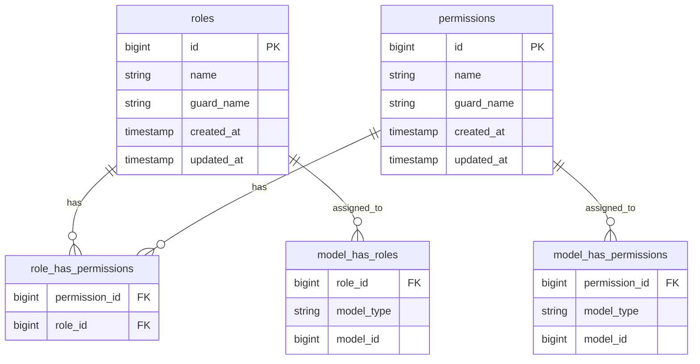

# Design Document: Role & Permission Management

## Overview

Peningkatan sistem Role & Permission Management pada Helpdesk GM untuk menyediakan antarmuka yang lebih intuitif dan powerful bagi admin dalam mengelola hak akses. Sistem ini dibangun di atas Spatie Laravel Permission yang sudah ada (~70 permission dalam 14 modul fitur) dengan penambahan fitur: per-feature bulk toggle, sub-feature toggle, dependency auto-resolution, preset templates, role duplication, search/filter, permission matrix view, system role protection, dan backend validation yang diperkuat.

### Design Decisions

1. **Frontend-driven dependency logic**: Seluruh logika dependency resolution diimplementasikan di frontend (`usePermissionManager` composable) karena dependency graph bersifat statis dan didefinisikan di `permissionConfig.js`. Backend hanya memvalidasi bahwa permission yang dikirim valid.

2. **No schema migration needed**: Menggunakan tabel Spatie Permission yang sudah ada (`roles`, `permissions`, `role_has_permissions`, `model_has_roles`). Tidak ada perubahan skema database.

3. **Configuration-as-code for feature groups**: Definisi feature group, sub-feature, dependencies, dan presets disimpan di `permissionConfig.js` sebagai single source of truth di frontend.

4. **Read-only permission matrix**: Matrix view bersifat read-only untuk menghindari kompleksitas editing multi-role sekaligus. Admin diarahkan ke form role individual untuk edit.

5. **System role protection both frontend and backend**: Validasi proteksi role sistem dilakukan di kedua layer untuk defense in depth.

## Architecture



### Request Flow



## Components and Interfaces

### Backend Components

#### RoleController (Enhanced)

```php
// Existing endpoints enhanced:
GET    /api/v1/roles                    // Enhanced: include permission counts per feature
GET    /api/v1/roles/{id}               // Enhanced: include users_count
POST   /api/v1/roles                    // Enhanced: stronger validation, duplicate handling
PUT    /api/v1/roles/{id}              // Enhanced: system role protection, superadmin lock
DELETE /api/v1/roles/{id}              // Enhanced: user count in error, superadmin protection

// New endpoints:
POST   /api/v1/roles/{id}/duplicate    // Duplicate role with all permissions
GET    /api/v1/roles/matrix            // Permission matrix data (all roles with permissions)
GET    /api/v1/roles/presets           // Get available preset configurations
```

#### RoleStoreRequest (Enhanced)

```php
public function rules(): array
{
    return [
        'name' => 'required|string|min:3|max:50|unique:roles,name',
        'permissions' => 'nullable|array',
        'permissions.*' => 'string|exists:permissions,name',
    ];
}
```

#### RoleUpdateRequest (Enhanced)

```php
public function rules(): array
{
    return [
        'name' => ['sometimes', 'string', 'min:3', 'max:50', Rule::unique('roles', 'name')->ignore($this->route('role'))],
        'permissions' => 'nullable|array',
        'permissions.*' => 'string|exists:permissions,name',
    ];
}
```

### Frontend Components

#### New Components

| Component | Location | Purpose |
|-----------|----------|---------|
| `PermissionMatrix.vue` | `views/admin/role/` | Read-only matrix view comparing roles |
| `PermissionMatrixCell.vue` | `components/admin/` | Individual cell in matrix with click-to-expand |
| `DependencyConfirmDialog.vue` | `components/admin/` | Confirmation dialog for cascading deselection |

#### Enhanced Components

| Component | Changes |
|-----------|---------|
| `RoleList.vue` | Add duplicate action button, permission summary badges per feature |
| `RoleForm.vue` | Add duplicate mode via query param, enhanced dependency dialog, sub-feature counter display |
| `usePermissionManager.js` | Add cascade deselection with confirmation, enhanced lock display |

### API Interfaces

#### POST /api/v1/roles/{id}/duplicate

**Request:** None (uses source role's permissions)

**Response (201):**
```json
{
  "success": true,
  "message": "Role berhasil diduplikasi",
  "data": {
    "id": 5,
    "name": "",
    "permissions": ["ticket-menu", "ticket-list", ...],
    "source_role": "staff"
  }
}
```

**Note:** Returns a pre-filled template. The frontend uses this to open the form with permissions pre-selected. The actual creation happens via the standard POST /roles endpoint with a new name.

Alternatively (simpler approach): The frontend reads the source role via GET /roles/{id} and opens the create form with those permissions. No new endpoint needed.

**Chosen approach:** Use existing GET /roles/{id} endpoint. Frontend reads source role permissions and pre-fills the form. This is simpler and avoids a new endpoint.

#### GET /api/v1/roles/matrix

**Response (200):**
```json
{
  "success": true,
  "message": "Data matrix berhasil diambil",
  "data": {
    "roles": [
      { "id": 1, "name": "admin", "is_system": true },
      { "id": 2, "name": "staff", "is_system": true }
    ],
    "matrix": {
      "admin": {
        "dashboard": { "selected": 7, "total": 7, "status": "full" },
        "ticket": { "selected": 14, "total": 14, "status": "full" }
      },
      "staff": {
        "dashboard": { "selected": 2, "total": 7, "status": "partial" },
        "ticket": { "selected": 8, "total": 14, "status": "partial" }
      }
    },
    "features": [
      { "key": "dashboard", "label": "Dashboard", "total": 7 },
      { "key": "ticket", "label": "Manajemen Tiket", "total": 14 }
    ]
  }
}
```

## Data Models

### Existing Schema (No Changes)



### Frontend Data Structures

#### Feature Group Config (existing, no changes)

```typescript
interface FeatureGroup {
  label: string;
  icon: string;
  description: string;
  color: string;
  permissions?: Record<string, PermissionDef>;
  subFeatures?: Record<string, SubFeature>;
}

interface SubFeature {
  label: string;
  icon: string;
  description: string;
  dependsOn?: string[];
  permissions: Record<string, PermissionDef>;
}

interface PermissionDef {
  label: string;
  description: string;
}
```

#### Permission Manager State

```typescript
interface PermissionManagerState {
  selectedPermissions: string[];           // Currently selected permission names
  dependencyLocks: Record<string, string[]>; // { lockedPerm: [lockedByPerm1, ...] }
}
```

#### System Role Constants

```php
// Backend
const SYSTEM_ROLES = ['admin', 'staff', 'user', 'superadmin'];
const IMMUTABLE_ROLES = ['superadmin']; // Cannot modify permissions
```

```javascript
// Frontend
const SYSTEM_ROLES = ['admin', 'staff', 'user', 'superadmin'];
const IMMUTABLE_ROLES = ['superadmin'];
```

## Correctness Properties

*A property is a characteristic or behavior that should hold true across all valid executions of a system — essentially, a formal statement about what the system should do. Properties serve as the bridge between human-readable specifications and machine-verifiable correctness guarantees.*

### Property 1: Feature toggle ON activates all permissions in group

*For any* Feature_Group that is not fully selected (status "none" or "partial"), calling toggleFeature should result in every permission within that Feature_Group (including all sub-features) being present in selectedPermissions.

**Validates: Requirements 1.1**

### Property 2: Feature toggle OFF preserves externally-locked permissions only

*For any* Feature_Group that is fully selected, calling toggleFeature should remove all permissions in that group EXCEPT those that appear in dependencyLocks due to active permissions in OTHER Feature_Groups.

**Validates: Requirements 1.2, 1.5**

### Property 3: Feature status reflects partial selection as indeterminate

*For any* Feature_Group where the count of selected permissions is greater than 0 and less than total permissions in that group, getFeatureStatus shall return 'partial'.

**Validates: Requirements 1.3**

### Property 4: Feature toggle ON resolves all cross-group dependencies

*For any* Feature_Group, after calling toggleFeature to activate it, every permission that is listed as a dependency (in permissionDependencies) of any permission within that group shall also be present in selectedPermissions, even if the dependency belongs to a different Feature_Group.

**Validates: Requirements 1.4, 2.4**

### Property 5: Sub-feature toggle OFF preserves externally-locked permissions

*For any* sub-feature that is fully selected, calling toggleSubFeature should remove all sub-feature permissions EXCEPT those locked by permissions outside that sub-feature.

**Validates: Requirements 2.3, 2.5**

### Property 6: Permission count per feature is accurate

*For any* array of selected permission names and any Feature_Group, countSelectedByFeature shall return a count that equals the number of permissions in the intersection of selectedPermissions and the Feature_Group's total permission set.

**Validates: Requirements 3.1**

### Property 7: Preset application replaces all permissions exactly

*For any* valid preset key, calling applyPreset shall result in selectedPermissions containing exactly the permissions defined in that preset's configuration, with no extras and no omissions.

**Validates: Requirements 4.2, 4.5**

### Property 8: Preset does not lock permissions from modification

*For any* preset application followed by a togglePermission call on any non-dependency-locked permission, the toggle shall succeed (return success: true).

**Validates: Requirements 4.3**

### Property 9: Role duplication preserves source permissions

*For any* existing role, reading its permissions and creating a new role with those same permissions via the API shall result in the new role having an identical permission set to the source role.

**Validates: Requirements 5.1, 5.5**

### Property 10: Role name uniqueness is enforced

*For any* role name that already exists in the database, attempting to create a new role with that same name shall be rejected with a validation error.

**Validates: Requirements 5.4**

### Property 11: Search filter returns only matching groups

*For any* search query string of at least 1 character, the filtered Feature_Groups shall only include groups where either the group label or at least one permission label/description within the group contains the query as a case-insensitive substring.

**Validates: Requirements 6.2**

### Property 12: Search preserves permission selection state

*For any* permission selection state and any search query, applying the search filter and then clearing it shall not modify selectedPermissions — the array shall remain identical before and after filtering.

**Validates: Requirements 6.3**

### Property 13: Recursive dependency resolution up to 3 levels

*For any* permission with dependencies, calling togglePermission to activate it shall also activate all transitive dependencies up to 3 levels deep. Formally: if A depends on B, and B depends on C, and C depends on D, then selecting A shall also select B, C, and D.

**Validates: Requirements 7.1**

### Property 14: Cascading deselection removes all dependents

*For any* permission that has active dependents, if the admin confirms deselection, all permissions that transitively depend on it shall also be removed from selectedPermissions.

**Validates: Requirements 7.3**

### Property 15: Dependency lock correctly identifies auto-activated permissions

*For any* permission P that was added to selectedPermissions as a dependency of another permission Q (i.e., P appears in permissionDependencies[Q]), the dependencyLocks map shall contain P as a key with Q in its value array, AND attempting to toggle P off while Q is still selected shall fail.

**Validates: Requirements 7.4, 7.5**

### Property 16: System roles cannot be deleted or renamed

*For any* role whose name is in SYSTEM_ROLES ('admin', 'staff', 'user', 'superadmin'), the API shall reject deletion requests with 403 and reject name change requests with 403.

**Validates: Requirements 8.1, 8.2**

### Property 17: Superadmin permissions are immutable

*For any* permission modification request targeting the superadmin role, the API shall reject it with 403 regardless of the permission content.

**Validates: Requirements 8.4**

### Property 18: Non-superadmin system roles allow permission changes

*For any* system role that is NOT superadmin (i.e., 'admin', 'staff', 'user'), the API shall accept permission modification requests and update the role's permissions accordingly.

**Validates: Requirements 8.3**

### Property 19: Non-system role deletion blocked when users assigned

*For any* non-system role that has at least 1 user assigned, the API shall reject deletion with 422 and include the user count in the error message.

**Validates: Requirements 8.5**

### Property 20: Matrix cell status correctness

*For any* role and Feature_Group combination, the matrix cell status shall be "full" if all permissions are active, "partial" if between 1 and total-1 are active, and "empty" if 0 are active.

**Validates: Requirements 9.2**

### Property 21: Backend rejects invalid permissions with details

*For any* request containing permission names that do not exist in the permissions table, the API shall reject the entire request with 422 and include a list of the invalid permission names in the response.

**Validates: Requirements 10.1, 10.2**

### Property 22: Duplicate permissions are deduplicated silently

*For any* permissions array containing duplicate entries, the API shall accept the request without error and store only unique permission instances.

**Validates: Requirements 10.3**

### Property 23: Null permissions field preserves existing permissions

*For any* role update request where the permissions field is absent or null, the role's existing permission set shall remain unchanged after the request completes.

**Validates: Requirements 10.4**

### Property 24: Empty permissions array clears all permissions

*For any* role update request where the permissions field is an empty array `[]`, all permissions previously assigned to that role shall be removed.

**Validates: Requirements 10.5**

## Error Handling

### Backend Error Responses

| Scenario | HTTP Code | Response Format |
|----------|-----------|-----------------|
| Invalid permission names in request | 422 | `{ "success": false, "message": "Validation error", "errors": { "permissions.0": ["Permission tidak valid"] } }` |
| Duplicate role name | 422 | `{ "success": false, "message": "Nama role sudah digunakan" }` |
| Delete/rename system role | 403 | `{ "success": false, "message": "Role sistem tidak dapat dihapus/diubah namanya" }` |
| Modify superadmin permissions | 403 | `{ "success": false, "message": "Permission role superadmin tidak dapat diubah" }` |
| Delete role with users | 422 | `{ "success": false, "message": "Role tidak dapat dihapus karena masih digunakan oleh X user" }` |
| Role not found | 404 | `{ "success": false, "message": "Role Tidak Ditemukan" }` |
| Server error | 500 | `{ "success": false, "message": "Terjadi kesalahan" }` |

### Frontend Error Handling

| Scenario | UI Behavior |
|----------|-------------|
| Toggle locked permission | Show amber warning banner with lock icon explaining which permission depends on it |
| API validation error | Show Alert component with error message, auto-dismiss in 5 seconds |
| Network failure on matrix load | Show inline error message with retry button |
| Cascading deselection | Show DependencyConfirmDialog listing all affected permissions before proceeding |
| Role name taken (on duplicate) | Show inline field error below name input |

### Dependency Resolution Edge Cases

1. **Circular dependencies**: The `getAllDependencies` function uses a `visited` Set to prevent infinite loops. Max depth is inherently limited by the dependency graph structure (currently max 3 levels).

2. **Cross-feature lock conflicts**: When Feature_Toggle OFF is attempted but permissions are locked by other features, only unlocked permissions are removed. The feature status stays 'partial' rather than failing silently.

3. **Preset with missing permissions**: If a preset references a permission that doesn't exist in featureGroups (due to config mismatch), it's silently included in selectedPermissions but won't appear in the UI grid. Backend validation catches invalid names.

## Testing Strategy

### Dual Testing Approach

**Property-Based Tests (PBT)** — using `fast-check` with Vitest for the frontend composable logic:

- Testing `usePermissionManager` functions: togglePermission, toggleFeature, toggleSubFeature, applyPreset
- Testing `countSelectedByFeature` and `getFeatureStatus` computations
- Testing search/filter logic
- Minimum 100 iterations per property test
- Tag format: **Feature: role-permission-management, Property {N}: {description}**

**Unit Tests** — example-based tests for:

- Frontend: Component rendering (RoleList badges, matrix cells, dependency dialog)
- Backend: RoleController endpoint behavior (system role protection, validation responses)
- Specific edge cases: empty states, maximum name length, superadmin immutability

**Integration Tests** — for:

- API endpoint round-trips (create role → fetch → verify permissions match)
- Permission matrix data aggregation
- Role duplication flow end-to-end

### PBT Library

- **Frontend**: `fast-check` (JavaScript property-based testing library) with Vitest
- **Backend**: `phpunit` with data providers for parameterized testing (Laravel's standard test framework doesn't have a dedicated PBT library, but data providers approximate property testing for API validation)

### Test File Structure

```
fe/tests/
  composables/
    usePermissionManager.property.test.js    # PBT for composable logic
    usePermissionManager.test.js             # Unit tests for specific cases
  config/
    permissionConfig.test.js                 # PBT for config helper functions
  views/
    RoleList.test.js                         # Component rendering tests
    RoleForm.test.js                         # Form interaction tests
    PermissionMatrix.test.js                 # Matrix rendering tests

api/tests/
  Feature/
    RoleControllerTest.php                   # API endpoint tests
    RoleProtectionTest.php                   # System role protection tests
    PermissionValidationTest.php             # Backend validation tests
```

### Key Test Scenarios

| Property | Generator Strategy |
|----------|-------------------|
| P1-P5 (Toggle logic) | Generate random subsets of all permission names, random feature keys |
| P6 (Count accuracy) | Generate random arrays from all possible permission names |
| P7-P8 (Presets) | Iterate over all preset keys, generate random subsequent toggles |
| P11-P12 (Search) | Generate random substrings of known labels, random unicode strings |
| P13-P15 (Dependencies) | Generate chains from permissionDependencies graph |
| P16-P19 (Backend) | Parameterized data providers with all system role combinations |
| P21-P24 (Validation) | Generate arrays mixing valid/invalid permission names, duplicates |
