# Alur Proses & Konfigurasi Sistem

Dokumen ini menjelaskan urutan proses kerja (workflow) sistem Helpdesk GM agar data terintegrasi dengan baik.

---

## Daftar Isi

1. [Overview Alur Sistem](#overview-alur-sistem)
2. [Inisiasi Sistem (Superadmin)](#1-inisiasi-sistem-superadmin)
3. [Persiapan Data Master (Admin)](#2-persiapan-data-master-admin)
4. [Alur Laporan Utilitas Harian](#3-alur-laporan-utilitas-harian)
5. [Alur Penanganan Masalah (End-to-End Ticketing)](#4-alur-penanganan-masalah-end-to-end-ticketing)
6. [Alur Pelaporan & Audit](#5-alur-pelaporan--audit)

---

## Overview Alur Sistem

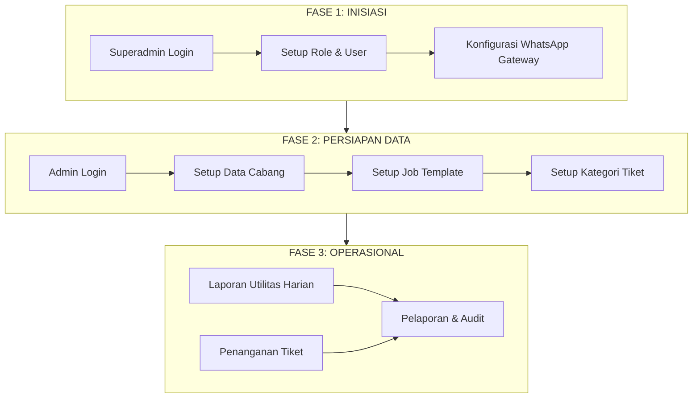

---

## 1. Inisiasi Sistem (Superadmin)

Langkah pertama sebelum aplikasi dapat digunakan adalah konfigurasi dasar oleh Superadmin.

### 1.1 Manajemen Role & User

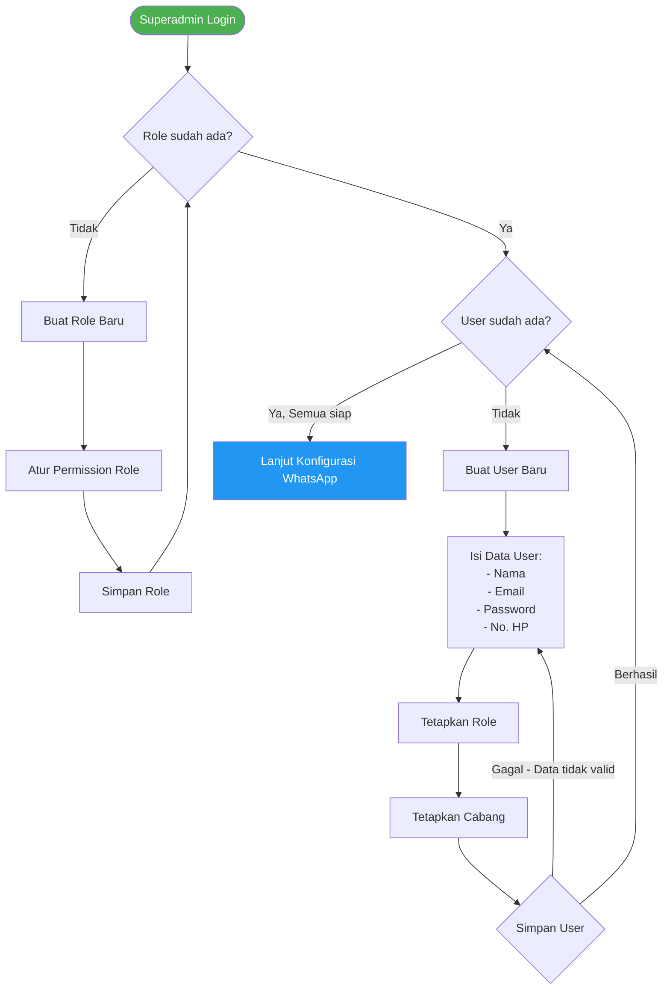

### 1.2 Konfigurasi WhatsApp Gateway

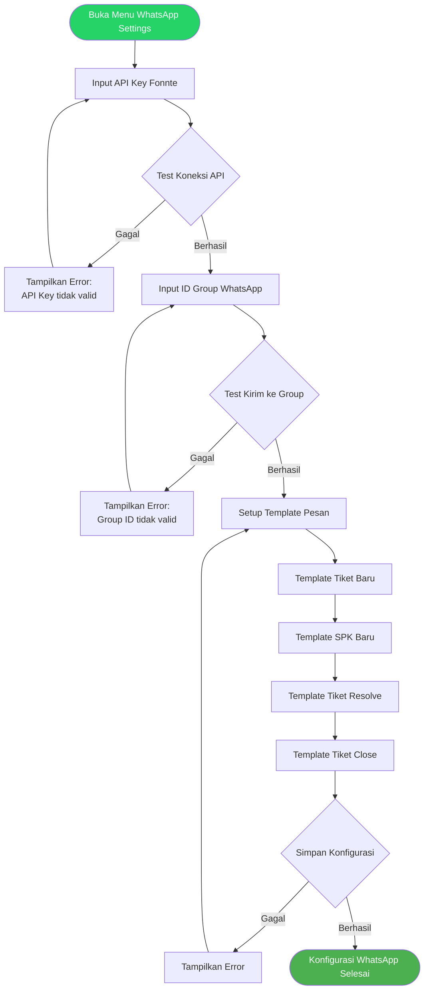

---

## 2. Persiapan Data Master (Admin)

Setelah user terbentuk, Admin bertugas menyiapkan "wadah" data agar operasional berjalan lancar.

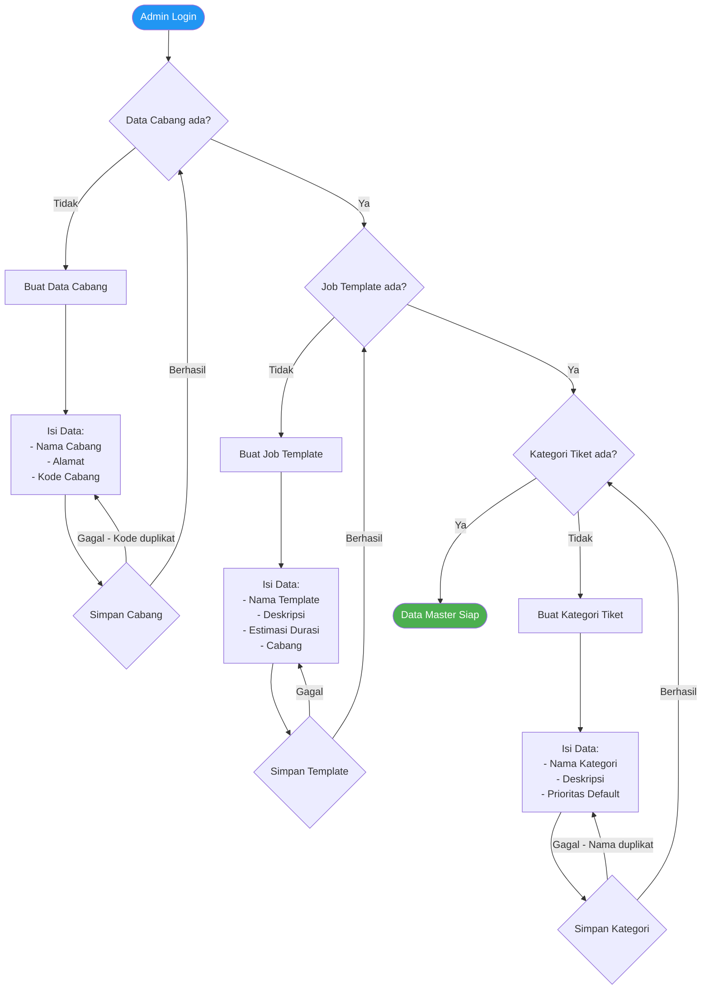

### Checklist Data Master

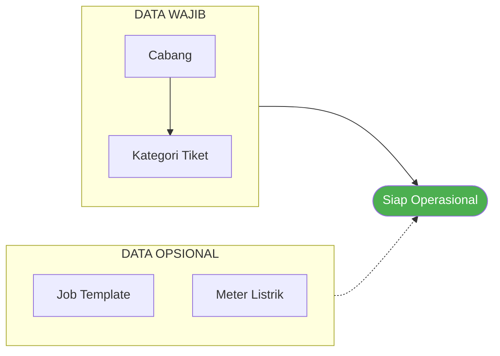

---

## 3. Alur Laporan Utilitas Harian

Proses ini dilakukan rutin setiap hari untuk pencatatan energi (Listrik, Air, Gas).

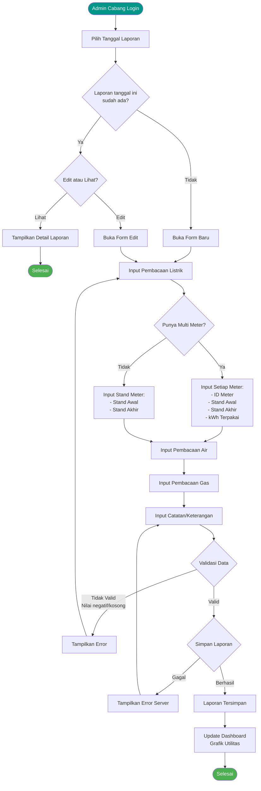

### Monitoring Laporan Utilitas

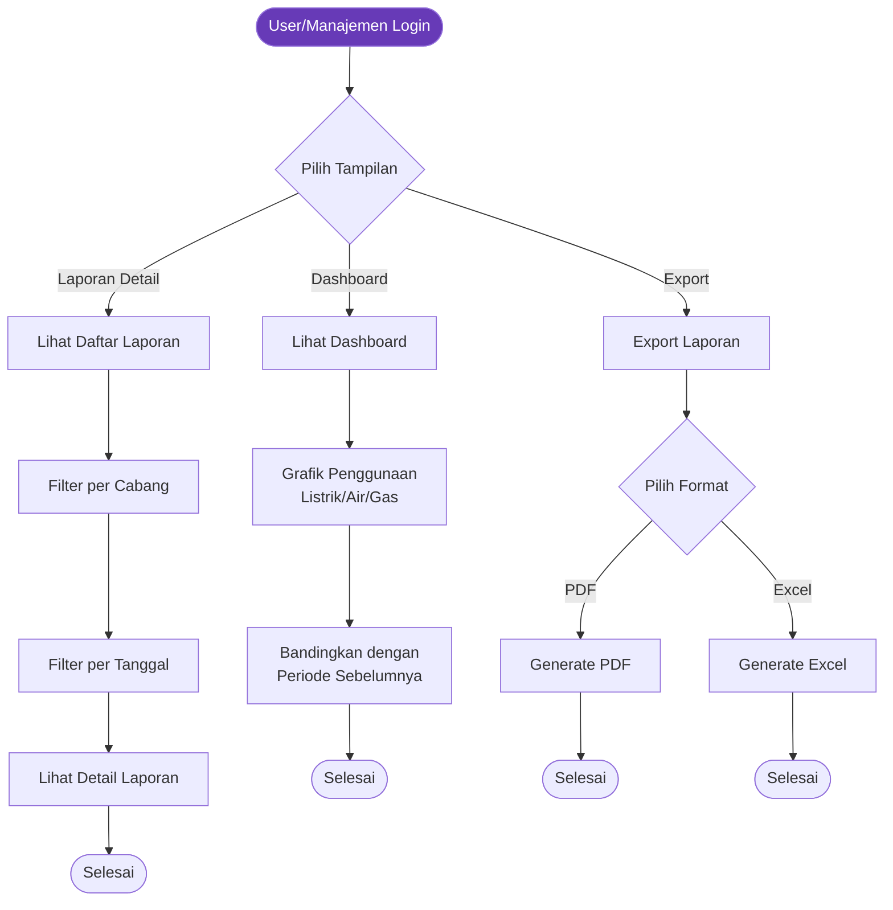

---

## 4. Alur Penanganan Masalah (End-to-End Ticketing)

Ini adalah **inti dari sistem Helpdesk**. Berikut adalah urutan kejadian dari awal kerusakan hingga selesai dalam **satu flowchart komprehensif**.

```mermaid
flowchart TD
    %% ==================== FASE 1: USER BUAT TIKET ====================
    subgraph FASE1["FASE 1: PEMBUATAN TIKET (USER)"]
        Start([USER LOGIN]) --> OpenForm[Buka Form Tiket Baru]
        OpenForm --> SelectCategory[Pilih Kategori Masalah]
        
        SelectCategory --> CategoryExist{Kategori<br/>tersedia?}
        CategoryExist -->|Tidak| ContactAdmin[Hubungi Admin untuk<br/>tambah kategori]
        ContactAdmin --> EndNoCategory([GAGAL: Tidak bisa lanjut])
        
        CategoryExist -->|Ya| FillTicket[Isi Data Tiket:<br/>- Judul<br/>- Deskripsi<br/>- Prioritas]
        FillTicket --> AttachFile{Lampirkan<br/>Foto?}
        
        AttachFile -->|Ya| UploadPhoto[Upload Foto Kerusakan]
        UploadPhoto --> ValidateFile{File Valid?<br/>Max 5MB}
        ValidateFile -->|Tidak| ErrorFile[Error: File tidak valid]
        ErrorFile --> AttachFile
        ValidateFile -->|Ya| SubmitTicket
        
        AttachFile -->|Tidak| SubmitTicket[Submit Tiket]
        
        SubmitTicket --> SaveTicket{Simpan ke<br/>Database}
        SaveTicket -->|Gagal| ErrorSave1[Tampilkan Error]
        ErrorSave1 --> FillTicket
        
        SaveTicket -->|Berhasil| TicketCreated[TIKET DIBUAT<br/>Status: OPEN]
        TicketCreated --> NotifTicket[Kirim Notifikasi WA]
        NotifTicket --> NotifToStaff[ke Staff Cabang]
        NotifTicket --> NotifToGroup[ke Grup Maintenance]
    end

    %% ==================== FASE 2: ADMIN TRIAGE ====================
    subgraph FASE2["FASE 2: TRIAGE & ASSIGN (ADMIN)"]
        NotifToStaff --> AdminView[ADMIN: Lihat Tiket Masuk]
        NotifToGroup --> AdminView
        
        AdminView --> ReviewTicket[Review Detail Tiket]
        ReviewTicket --> ValidTicket{Tiket Valid?}
        
        ValidTicket -->|Tidak - Spam/Duplikat| RejectTicket[Tolak Tiket]
        RejectTicket --> AddRejectReason[Tambah Alasan Penolakan]
        AddRejectReason --> TicketRejected[Status: REJECTED]
        TicketRejected --> NotifyReject[Notifikasi ke User:<br/>Tiket Ditolak]
        NotifyReject --> EndRejected([SELESAI: Tiket Ditolak])
        
        ValidTicket -->|Ya| AssignStaff[Assign Staff/Teknisi]
        AssignStaff --> SelectStaff{Pilih Staff}
        
        SelectStaff -->|Staff Lokal| PickLocal[Pilih Staff Cabang]
        SelectStaff -->|Butuh BKO| PickBKO[Pilih Staff dari<br/>Cabang Lain]
        
        PickLocal --> NeedSPK
        PickBKO --> NeedSPK{Perlu SPK?}
        
        NeedSPK -->|Tidak - Minor| DirectAssign[Update Tiket:<br/>IN PROGRESS]
        DirectAssign --> NotifyDirectStaff[Notifikasi ke Staff]
        NotifyDirectStaff --> StaffReceive
        
        NeedSPK -->|Ya| CreateSPK[Buat SPK]
        CreateSPK --> FillSPK[Isi Data SPK:<br/>- Judul Pekerjaan<br/>- Deskripsi<br/>- Deadline<br/>- Staff Ditugaskan]
        FillSPK --> LinkToTicket[Link ke Tiket]
        LinkToTicket --> SaveSPK{Simpan SPK}
        
        SaveSPK -->|Gagal| ErrorSPK[Tampilkan Error]
        ErrorSPK --> FillSPK
        
        SaveSPK -->|Berhasil| SPKCreated[SPK DIBUAT<br/>Status: PENDING]
        SPKCreated --> UpdateTicketAssigned[Tiket: ASSIGNED]
        UpdateTicketAssigned --> NotifySPKCreated[Kirim Notifikasi WA]
        NotifySPKCreated --> NotifySPKStaff[ke Staff: SPK Baru]
        NotifySPKCreated --> NotifySPKGroup[ke Grup: SPK Diterbitkan]
    end

    %% ==================== FASE 3: STAFF EKSEKUSI ====================
    subgraph FASE3["FASE 3: EKSEKUSI PEKERJAAN (STAFF)"]
        NotifySPKStaff --> StaffReceive[STAFF: Terima Notifikasi]
        NotifySPKGroup --> StaffReceive
        
        StaffReceive --> ViewSPK[Lihat Detail SPK & Tiket]
        ViewSPK --> CanHandle{Bisa<br/>Ditangani?}
        
        CanHandle -->|Tidak - Butuh Bantuan| RequestHelp[Request Bantuan ke Admin]
        RequestHelp --> WaitReassign[Tunggu Reassignment]
        WaitReassign --> AdminView
        
        CanHandle -->|Tidak - Alat Tidak Ada| ReportKendala[Laporkan Kendala]
        ReportKendala --> AddKendalaComment[Tambah Komentar di Tiket]
        AddKendalaComment --> WaitReassign
        
        CanHandle -->|Ya| ConfirmStart[Konfirmasi Mulai Kerja]
        ConfirmStart --> TicketInProgress[Tiket: IN PROGRESS]
        TicketInProgress --> SPKInProgress[SPK: IN PROGRESS]
        
        SPKInProgress --> DoWork[Kerjakan Perbaikan<br/>di Lapangan]
        
        DoWork --> WorkComplete{Pekerjaan<br/>Selesai?}
        
        WorkComplete -->|Tidak - Ada Kendala| ReportProblem[Laporkan Masalah]
        ReportProblem --> AddReply[Tambah Balasan di Tiket]
        AddReply --> WaitDecision{Keputusan<br/>Admin?}
        WaitDecision -->|Lanjutkan| DoWork
        WaitDecision -->|Cancel| CancelSPK[Cancel SPK]
        CancelSPK --> SPKCancelled[SPK: CANCELLED]
        SPKCancelled --> EndCancelled([SELESAI: SPK Dibatalkan])
        
        WorkComplete -->|Ya| CompleteSPK[Klik Selesai SPK]
        CompleteSPK --> SPKDone[SPK: DONE]
        SPKDone --> NotifyWorkDone[Notifikasi ke Grup:<br/>Pekerjaan Selesai]
        
        NotifyWorkDone --> ResolveTicket[Update Tiket: RESOLVED]
        ResolveTicket --> NotifyUserResolved[Notifikasi ke User:<br/>Masalah Diperbaiki]
        
        NotifyUserResolved --> CreateWorkReport[Buat Laporan Pekerjaan]
        CreateWorkReport --> FillWorkReport[Isi Detail:<br/>- Deskripsi Pekerjaan<br/>- Material Digunakan<br/>- Waktu Pengerjaan]
        FillWorkReport --> AttachBukti{Upload<br/>Foto Bukti?}
        
        AttachBukti -->|Ya| UploadBukti[Upload Foto Before/After]
        UploadBukti --> SaveWorkReport
        AttachBukti -->|Tidak| SaveWorkReport[Simpan Laporan]
        
        SaveWorkReport --> ReportSaved{Berhasil?}
        ReportSaved -->|Tidak| ErrorReport[Error Simpan]
        ErrorReport --> FillWorkReport
        ReportSaved -->|Ya| WorkReportDone[Laporan Tersimpan]
    end

    %% ==================== FASE 4: USER CLOSE TIKET ====================
    subgraph FASE4["FASE 4: PENUTUPAN TIKET (USER)"]
        WorkReportDone --> UserNotified[USER: Terima Notifikasi<br/>Tiket Resolved]
        
        UserNotified --> UserCheckResult[Periksa Hasil Pekerjaan]
        UserCheckResult --> UserSatisfied{Puas dengan<br/>Hasil?}
        
        UserSatisfied -->|Tidak| UserFeedback[Tambah Komentar/Feedback]
        UserFeedback --> WantReopen{Buka Ulang<br/>Tiket?}
        
        WantReopen -->|Ya| ReopenTicket[Reopen Tiket]
        ReopenTicket --> TicketReopened[Status: REOPENED]
        TicketReopened --> NotifyReopen[Notifikasi ke Admin & Staff]
        NotifyReopen --> AdminView
        
        WantReopen -->|Tidak| SubmitFeedbackOnly[Submit Feedback Saja]
        SubmitFeedbackOnly --> UserCheckResult
        
        UserSatisfied -->|Ya| CloseTicket[Klik Tombol Close/Selesai]
        CloseTicket --> ConfirmClose{Konfirmasi<br/>Penutupan?}
        
        ConfirmClose -->|Batal| UserCheckResult
        ConfirmClose -->|Ya| TicketClosed[TIKET DITUTUP<br/>Status: CLOSED]
        
        TicketClosed --> NotifyClose[Kirim Notifikasi WA]
        NotifyClose --> NotifyCloseStaff[ke Staff: Tiket Ditutup]
        NotifyClose --> NotifyCloseGroup[ke Grup: Tiket Selesai]
        
        NotifyCloseStaff --> EndSuccess([SELESAI: Masalah Tuntas])
        NotifyCloseGroup --> EndSuccess
    end

    %% ==================== STYLING ====================
    %% Start & End nodes
    style Start fill:#FF9800,color:#fff
    style EndNoCategory fill:#9E9E9E,color:#fff
    style EndRejected fill:#f44336,color:#fff
    style EndCancelled fill:#f44336,color:#fff
    style EndSuccess fill:#4CAF50,color:#fff
    
    %% Key status changes
    style TicketCreated fill:#2196F3,color:#fff
    style TicketRejected fill:#f44336,color:#fff
    style SPKCreated fill:#9C27B0,color:#fff
    style UpdateTicketAssigned fill:#3F51B5,color:#fff
    style TicketInProgress fill:#00BCD4,color:#fff
    style SPKInProgress fill:#00BCD4,color:#fff
    style SPKDone fill:#009688,color:#fff
    style SPKCancelled fill:#f44336,color:#fff
    style ResolveTicket fill:#8BC34A,color:#fff
    style TicketReopened fill:#FF5722,color:#fff
    style TicketClosed fill:#4CAF50,color:#fff
```

### Ringkasan Status Tiket

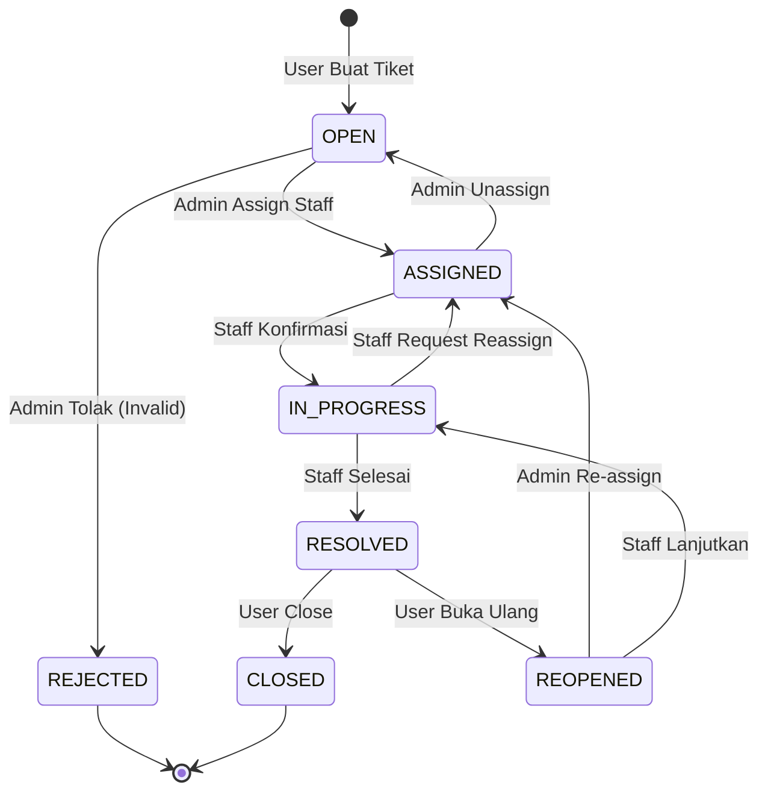

### Ringkasan Status SPK

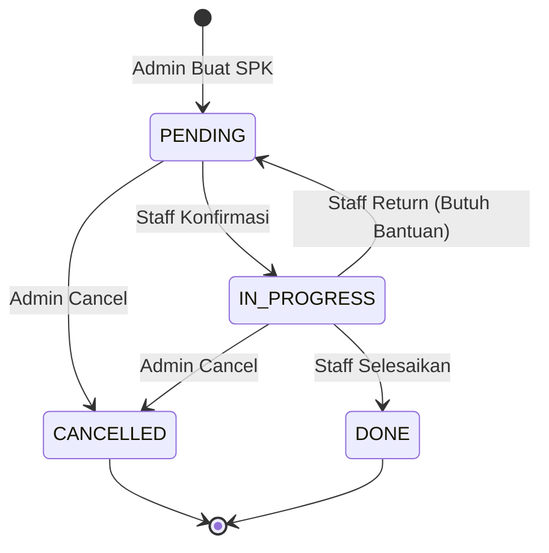

---

## 5. Alur Pelaporan & Audit

Setelah operasional berjalan, Admin/Manajemen melakukan evaluasi.

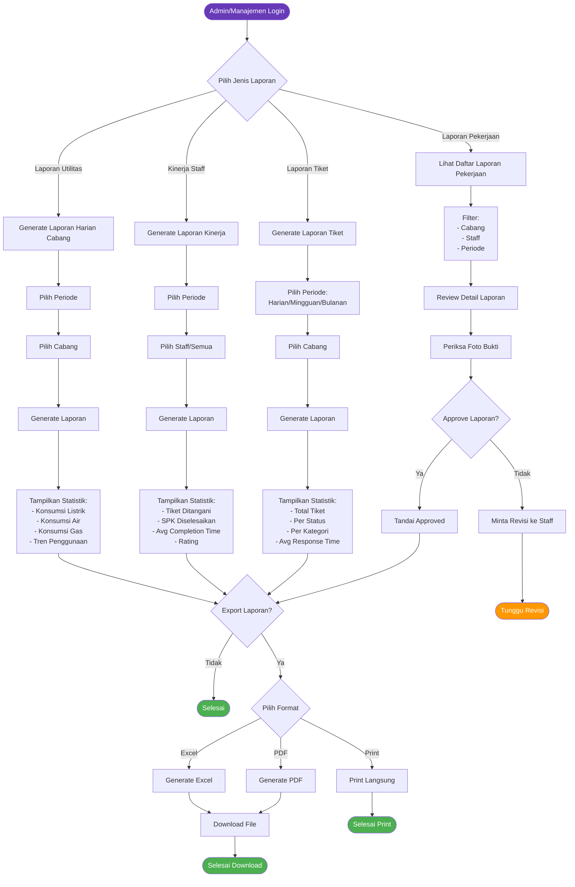

### Dashboard Monitoring

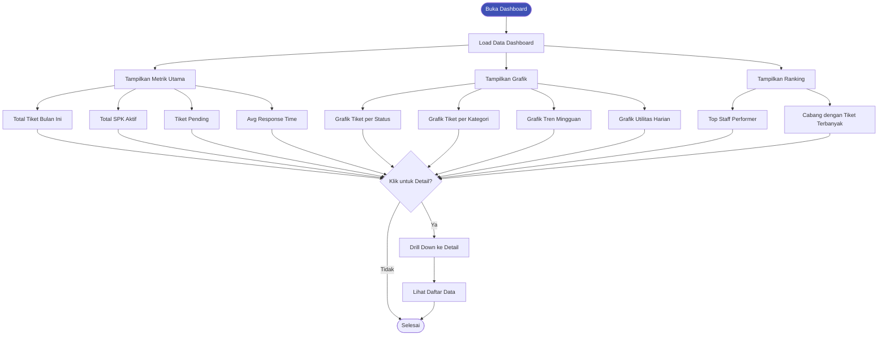

---

## Ringkasan Notifikasi WhatsApp

| Event | Penerima | Contoh Pesan |
|-------|----------|--------------|
| Tiket Baru | Staff Cabang, Grup WA | "Tiket baru #TKT-001: AC Rusak di Ruang Meeting" |
| SPK Dibuat | Staff yang Ditugaskan | "SPK baru #SPK-001 untuk Anda. Deadline: 2024-01-15" |
| SPK Selesai | Grup WA | "SPK #SPK-001 telah diselesaikan oleh Staff A" |
| Tiket Resolved | User Pelapor | "Tiket #TKT-001 sudah diperbaiki. Silakan cek dan tutup tiket." |
| Tiket Closed | Staff, Grup WA | "Tiket #TKT-001 ditutup oleh User. Terima kasih!" |
| Tiket Reopened | Admin, Staff | "Tiket #TKT-001 dibuka ulang oleh User. Alasan: ..." |

---

## Catatan Penting

1. **Urutan Konfigurasi Wajib:**
   - Superadmin setup Role & User terlebih dahulu
   - Admin setup Data Master sebelum operasional
   - Tanpa Kategori Tiket, User tidak bisa membuat tiket

2. **Dependency Permission:**
   - Untuk melihat menu, user butuh permission `*-menu`
   - Untuk CRUD, user butuh permission `*-list`, `*-create`, `*-edit`, `*-delete`

3. **Notifikasi WhatsApp:**
   - Membutuhkan API Key Fonnte yang valid
   - Group ID harus sudah terdaftar
   - Bot WhatsApp harus sudah di-add ke grup
